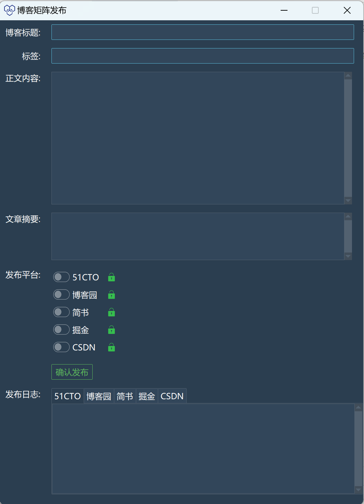

# 博客矩阵系统

一个基于 GUI 的博客发布系统，支持一键发布到多个平台，包括 51CTO、博客园、简书、掘金和 CSDN。该工具旨在简化内容创作者跨平台分享内容的流程。

<div align="center">
    
</div>

## 功能特性

- **一键发布**：一次发布博客到多个平台。
- **可自定义输入**：填写博文标题、标签、正文内容、摘要，并选择目标平台。
- **图形界面**：便捷的 GUI 界面，优化博客发布流程。
- **发布日志**：实时显示各平台的发布过程与结果。

## 快速开始

### 前置条件

请确保已安装以下环境：

- Python 3.x

### 运行


3. 运行程序：

   ```bash
   python start.py
   ```


## 使用指南

1. 运行 `start.py` 以启动 GUI。
2. 在 GUI 中填写以下信息：
   - **博文标题**：输入博客的标题。
   - **博文标签**：填写与博客内容相关的关键词或标签。
   - **正文内容**：输入文章的主要内容。
   - **文章摘要**：简短概述或摘要。
   - **发布平台**：选择希望发布的目标平台。
3. 点击“发布”按钮，即可开始发布至所选平台。
4. 通过发布日志查看各平台的发布成功或错误信息。

## 支持平台

- [51CTO](https://51cto.com)
- [博客园](https://cnblogs.com)
- [简书](https://jianshu.com)
- [掘金](https://juejin.im)
- [CSDN](https://csdn.net)

## 参与贡献

欢迎社区贡献！请 fork 本仓库并提交 pull request 以添加新功能、修复 Bug 或优化代码。

## 开源协议

本项目基于 MIT 许可证，详情请参阅 LICENSE 文件。

